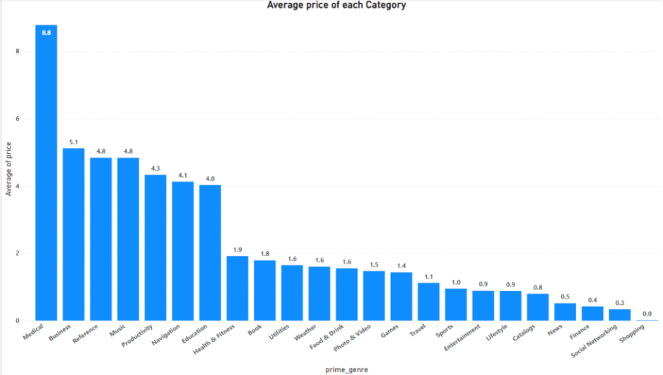
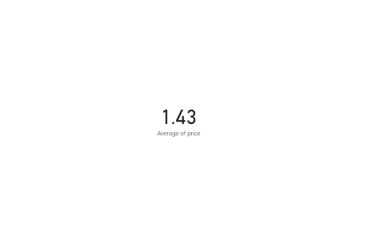
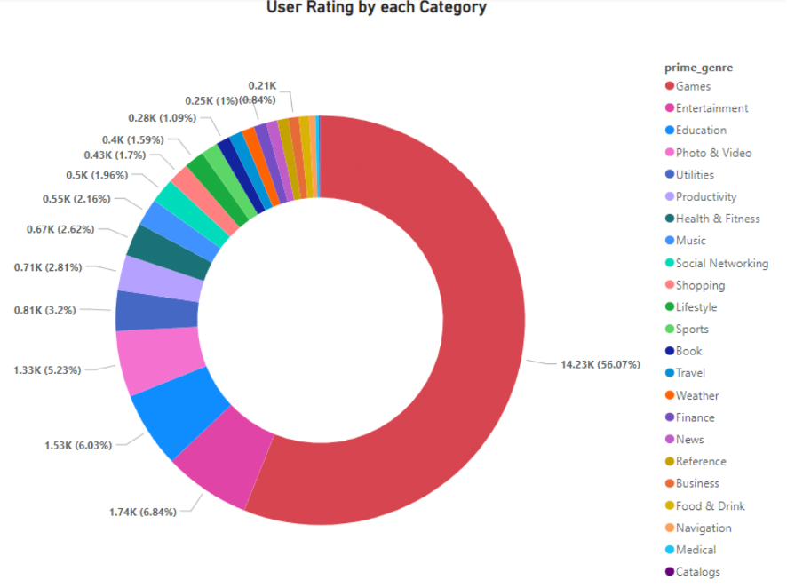
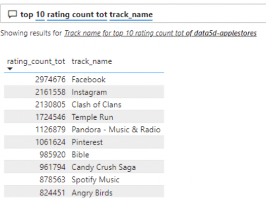
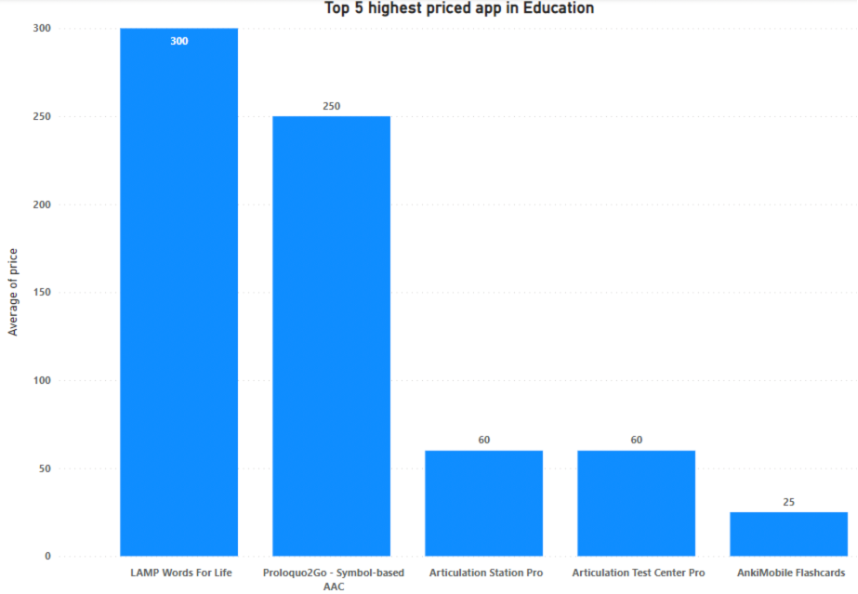
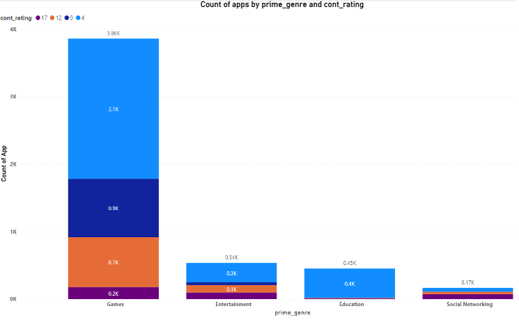

# Power BI
Power BI is be used to analyze and draw insights from Apple store dataset.

## About Power BI

Like many other visualization tools available in the market, it is a collection of software services, apps, and connectors that cumulatively help the user to derive useful, interactive, and visually appealing graphs, which can be shared across the organization of via an app or website (Microsoft, 2022). The data used for drawing insights can be imported from the local computer in csv or excel format or it can be cloud based. I chose to include this tool in my portfolio as it is a free and self-service data analysis tool which can be easily installed and used to design dashboards, reports, and various insights on a Windows computer. Following are the key capabilities of this tool (Stitch, 2022):

 - All the work and the visualizations created in this tool can be easily shared with other Power BI users which further helps in creating a collaborative environment.
 - It is integrated with other Microsoft products like Azure, Cortana to collectively work on data which improves the interactivity with the user.
 - Power BI enables the users to create visualizations using artificial intelligence with its capabilities of Q&A Visualization, Key Influencers, and many more.
 - It is a user-friendly tool which has Business Intelligence capabilities to further improve its functionalities.
 - It has the ability to use custom data visualizations downloaded from Microsoft Marketplace to enhance the data visualizations.
 - The dashboards and the graphs created are very informative and can be updated in real-time as the organization’s data evolves.
 - It is constantly improving to provide the best features at a single platform.

## Dataset and Research questions

Power BI will be used to analyze Apple store dataset which contains id (referring to App id), track_name (referring to Application name), size_bytes (referring to Memory size in Bytes), app_desc (referring to Application description), currency, price, cont_rating (referring to Content Rating), and user rating of 7200 apps. It was last updated in 2018 (Ramanathan, 2018). This is a very small dataset and might not cover all the aspects that are required to gain insights about different genres of the apps. Also, some of the application descriptions are not clear and not well-mentioned. Since, this is a practice lab, the dataset serves its purpose of practising the tool and answering few questions which help us to dig deeper into the information being provided.

Following are the questions that will be answered:

 - Which category has the highest and the lowest average price?
 - Create a graph that depicts User Rating by each Category.
 - What are the top 10 apps with the highest total number of ratings?
 - What are the top 5 highest priced app in the Education genre?
 - What is the total count of apps with the 17+, 12+, 9+, and 4+ content rating in the category: Games, Entertainment, Education, and Social Networking?

## Applying the Analytical Tool and Results

##### Question 1: Which category has the highest and the lowest average price?
Figure shows a column chart where x-axis represent the Category and the y-axis represent the Average price. Medical and Shopping are the categories which have highest and lowest average price respectively. Medical might be on top of the chart because of the health care it provides and how much cost goes into developing it in such a way that the value of money if provided to the customers. Whereas Shopping might be on the lowest end as all the revenue is generated via shopping on the apps, rather than installing them. Next figure shows the value of Average price of Games which is obtained by inserting a card. This is a feature in Power BI that summarizes a single feature that needs to be investigated along with conducting comparisons in real-time.

 

##### Question 2: Create a graph that depicts User Rating by each Category
The following figure shows a donut chart where different colors represent the genres, and each section represents the user rating of each genre. The graph suggests that Games have the highest user rating and Catalogs have the least. This might be because majorly people download the apps for gaming purposes. Entertainment and Education are the second and third category respectively in terms of user ratings.

##### Question 3: What are the top 10 apps with the highest total number of ratings?
Following figure shows the top 10 apps with the highest total number of ratings in which the first 2 apps belong to social networking genre, followed by gaming apps. This table is obtained via using the Chart feature of Power BI. It is a Q&A format, where the user can get the results of any question that they have entered. Rating_count_tot is the field that represents total number of rating and track_name is the application name. This is a great way to get to-the-point and clear answers about the data in a manner that is also visually well understandable.

##### Question 4: What are the top 5 highest priced app in the Education genre?
Following figure shows a column chart where x-axis represent the application name (track_name) and y-axis represent the average of price and a filter is applied to the category (prime_genre) to only select Education. The highest priced app is Lamp Words for Life with the price being 300 USD.

##### Question 5: What is the total count of apps with the 17+, 12+, 9+, and 4+ content rating in the category: Games, Entertainment, Education, and Social Networking?
Following is a stacked chart where x-axis is Genre, y-axis is Count of App, and the color represents Content Rating. According to the graph, Games has highest Count of App while Social Networking has the lowest out of all the 4 categories. Most of the Apps in each category has a 4+ rating. Education category has 4500 apps out of which 4000 apps have a content rating of 4+.

## Analysis and Critique of the Tool

Power BI is a great tool for the purpose of data analysis and identifying the important insights from the data. It is majorly required in many organizations as it makes it easier for the analysts to share their visualizations within and outside the organizations to create a collaborative environment. It is an impressive and user-friendly tool with drag and drop features and self-service capabilities. It has also provided with vast range of options from where the data can be imported such as Microsoft Excel, Azure, Cloud-based sources, or online services such as Google Analytics (Data Flair, 2022). The most distinguishable feature of Power BI is that it enables the user to create intuitive and interactive visualizations which are easy to create and understand. Also, it is always improving and updating which has created a trustable environment for users as their requirements and suggestions are being heard.

The major issue I faced while using this tool is with the flexibility it provided to configure my graphs. It does not provide many options for the users to improve or modify their visuals such as adding labels or adding multiple filters. Also, I found that creating a calculated and new field in Power BI might not always give the expected results and is tougher than it should be. In my opinion, the user interface can also be improved a little to help the user in creating visually appealing graphs rather than just the informative ones. I believe there is already a tough competition among the data visualization applications available for free in the market, therefore having a tool which is easy-to-use and gives major flexibility in terms of modifying the visual as per the needs will be preferred.

## Conclusion:

Overall, despite few setbacks faced while working with Power BI, it is a great tool for creating informative graphs and visuals. Also, the important thing is that Microsoft is continuously working on making this tool better and listening to the feedbacks of its users to make it more user-friendly. Besides this, users often feel the requirement of switching to a premium version of this tool for more features and functionalities, which I believe is not an obstacle for large organizations. Therefore, it is an important and useful tool to know and better versions of this tool can be expected in the future.
